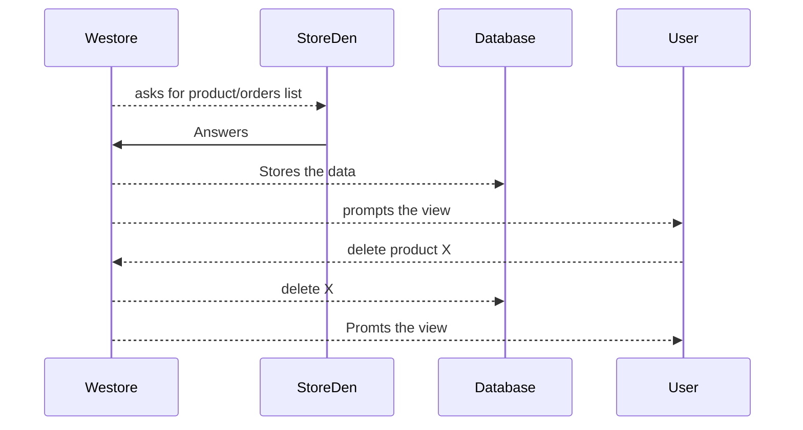
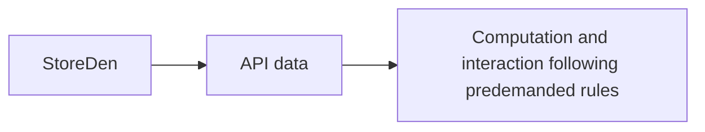

# Welcome to WebStore!

This is an implementation of a part of an e-commerce component using symfony, fixtures, RESTful API calls, encrypted authentication, user masquerading and other functionalities.

# TIME
11 hours

# Files

To install the application, you'll need to run on your system a MySQL server. User: root password: none. It is customizable on the `.env` file once you've setted up your dabatase as your preference.

Then you'll need php v7.3 or higher to run bin commands and make the required database migrations and fixtures. Once everything is on its way, you can access to the server address and log in.

## Installation

To install the webstore application, ensure that the project files are located onto your webserver folder. Ensure your database service is running.

Open your DBMS and create a databse called `webstore`

Then, open the terminal and move into the project folder. Ensure that your database service is running and php is installed. Then, on the command prompt, run:

- `php bin/console doctrine:migrations:migrate`
- `php bin/console doctrine:fixtures:load`

as the project is brand new, accept the messages prompted and continue the installation

Then check if on your database there's the correct data structure.

Hence check if your web server (wether apache or nginx) is allowed to interpret php pages. As the main folder, set `./public`. You'll then be able to access to the localhost address and view the symfony main page.

## Logging in

On the web portal, visit `127.0.0.1/product` and for access use:

- admin@mail.com and admin as username and password for the admin access.
- editor@mail.com and editor as username and password for the editor access.
- assistant@mail.com and assistant as username and password for the assistant access.

## Working principle

Part of the call waterfalls and main logical interactions

Flow chart:

